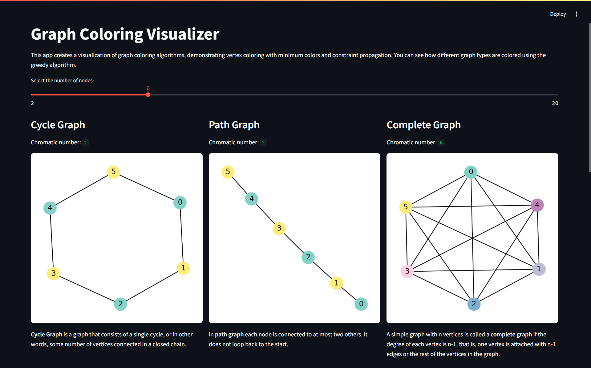
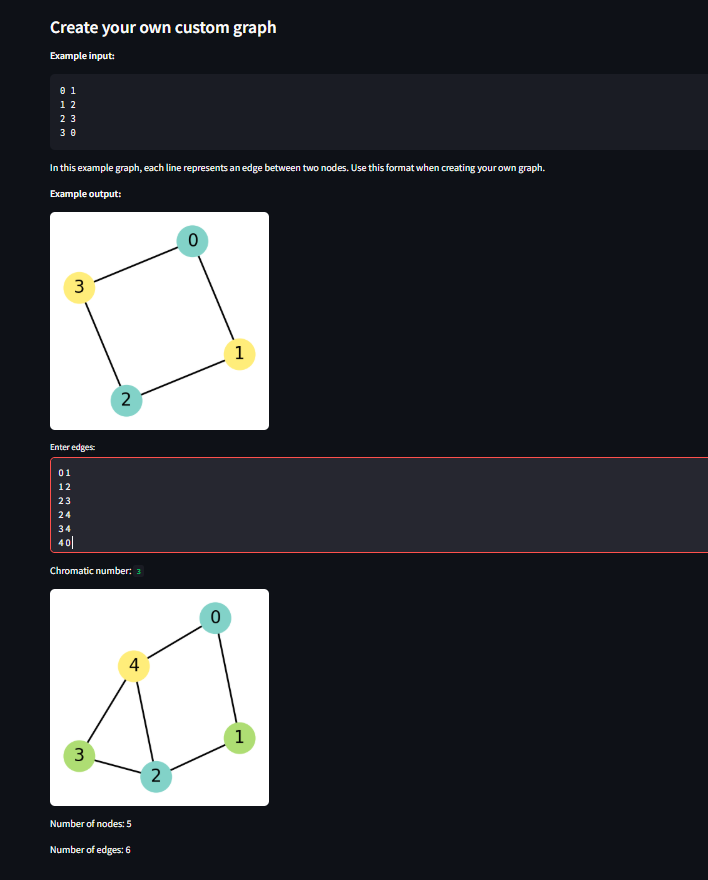

# [Graph Coloring] - Interactive Visualization

## Project Overview

This project is an interactive web application developed with `Streamlit` , used `Greedy Algorithm` , to visualize `Graph Coloring` Algorithm , developed as part of the Algorithms and Programming II course at Fırat University, Software Engineering Department.

## Algorithm Description

The Greedy Coloring Algorithm colors the graph’s vertices one by one. At each step, it assigns the smallest available color that hasn’t been used by any of its neighbors.

Key Concepts:
- It uses a dictionary to store the color of each node.

- For each node:

   - It collects the colors of all neighboring nodes.

   - It assigns the lowest color (starting from 0) not used by neighbors.

- It continues until all nodes are colored.

This approach doesn’t guarantee the optimal chromatic number but is efficient and often close to optimal for sparse graphs.

### Problem Definition
---
Color the vertices of a graph such that no two adjacent vertices have the same color, using the minimum number of colors.

### Mathematical Background
---
Graph coloring is a function defined on a graph G=(V,E), where:
- V is the set of vertices (nodes),
- 𝐸 is the set of edges (connections between nodes).

We define a coloring function: c: V → C
Where:
- C is a set of colors,
- c(v) is the color assigned to vertex v.

#### Valid Coloring Condition
For the coloring to be valid: ∀(u,v) ∈ E , c(u) ≠ c(v)
This means no two adjacent vertices (connected by an edge) should have the same color.

#### Chromatic Number
The chromatic number χ(G) of a graph G is the minimum number of colors needed to color the graph such that the condition above is satisfied:

χ(G)=min{∣C∣ : c:V→C is a proper coloring}

### Algorithm Steps
---
1. Initialize an empty dictionary coloring.
2. For each node in the graph:

      - Get the colors of its neighbors (neighbor_colors).

      - Start with color 0 and increase until a color not in neighbor_colors is found.

      - Assign that color to the node.
3. Return the coloring dictionary.


### Pseudocode
---
```
Algorithm Greedy_Coloring(Graph G)
    Input: A graph G = (V, E) with vertices V and edges E
    Output: A dictionary Coloring that maps each vertex to a color

    Initialize an empty dictionary Coloring

    For each vertex u in V do
        Initialize an empty set Neighbor_Colors

        For each neighbor v of u do
            If v is in Coloring then
                Add Coloring[v] to Neighbor_Colors
            End If
        End For

        color ← 0
        While color is in Neighbor_Colors do
            color ← color + 1
        End While

        Set Coloring[u] ← color
    End For

    Return Coloring

```

## Complexity Analysis

### Time Complexity

- **Best Case:** O(V + E) - ` Each node and edge visited once.`
- **Average Case , Worst Case:** O(V^2) - `In dense graphs with many neighbors per node.`

### Space Complexity

- O(V) - `For storing color assignments in a dictionary.`

## Features

- Custom graph input through an interactive interface.
- Visual step-by-step coloring using Matplotlib and NetworkX.
- Clean and responsive layout using Streamlit.

## Screenshots


*In the begining of the page there is the description of the algorithm and a slider to visualize 3 different types of graphics containing same number of nodes but different cromatic numbers and functionalities.*



*At the end of the main visualizer page , users can create their own graphics and an example input and output to help them.*

## Installation

### Prerequisites

- Python 3.8 or higher
- Git

### Setup Instructions

1. Clone the repository:
   ```bash
   git clone (https://github.com/YagmurCelikkaya/algorithms-and-programming-ii-semester-capstone-project-YagmurCelikkaya.git)
   cd your-repository
   ```

2. Create a virtual environment:
   ```bash
   # On Windows
   python -m venv venv
   venv\Scripts\activate

   # On macOS/Linux
   python3 -m venv venv
   source venv/bin/activate
   ```

3. Install dependencies:
   ```bash
   pip install -r requirements.txt
   ```

4. Run the application:
   ```bash
   streamlit run app.py
   ```

## Usage Guide

1. Run the app with streamlit run app.py
2. Visualize the graph coloring examples
3. Custom your own coloring graph
4. Enter the edges of your graph (e.g., A-B, B-C, C-A)
5. Click "ctrl + enter" to run your custom graph


### Example Inputs

- [1-2, 2-3, 3-1, 3-4]
- [A-B, B-C, C-D, D-E, E-A]
- [0-1, 1-2, 2-0, 0-3, 3-4, 4-2]

## Implementation Details

### Key Components

- `algorithm.py`: Greedy coloring logic
- `app.py`: Streamlit interface
- `utils.py`: Helper functions for data processing
- `visualizer.py`: Graph drawing using NetworkX and Matplotlib

### Code Highlights

```python
def greedy_coloring(graph):
    coloring = {}
    for node in graph.nodes():
        neighbor_colors = {coloring[neighbor] for neighbor in graph.neighbors(node) if neighbor in coloring}
        color = 0
        while color in neighbor_colors:
            color += 1
        coloring[node] = color
    return coloring

```

## Testing

This project includes a test suite to verify the correctness of the algorithm implementation:

```bash
python -m unittest test_algorithm.py
```

### Test Cases

- Cycle graphs.
- Disconnected components.
- Complete graphs.

## Live Demo

A live demo of this application is available at: [(https://algorithms-and-programming-ii-semester-capstone-project-yagmur.streamlit.app/)]

## Limitations and Future Improvements

### Current Limitations

- Greedy algorithm doesn't always give optimal results.
- Only undirected graphs supported.
- No drag-and-drop UI for graph editing.

### Planned Improvements

- Add animation of the coloring process.
- Save/load graphs locally.

## References and Resources

### Academic References

1. Thomas H. Cormen , Introduction to Algorithms Chapter 16

### Online Resources

- GeeksforGeeks - Graph Coloring
- NetworkX Documentation
- Brilliant - Graph Coloring and Chromatic Numbers

## Author

- **Name:** R.Yağmur Çelikkaya
- **Student ID:** 230543011
- **GitHub:** YagmurCelikkaya

## Acknowledgements

I would like to thank Assoc. Prof. Ferhat UÇAR for guidance throughout this project, and [any other acknowledgements].

---

*This project was developed as part of the Algorithms and Programming II course at Fırat University, Technology Faculty, Software Engineering Department.*
